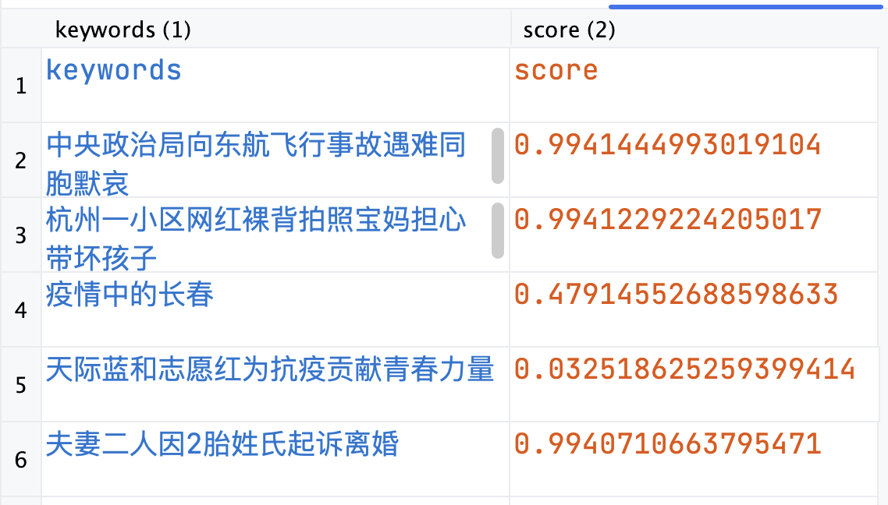
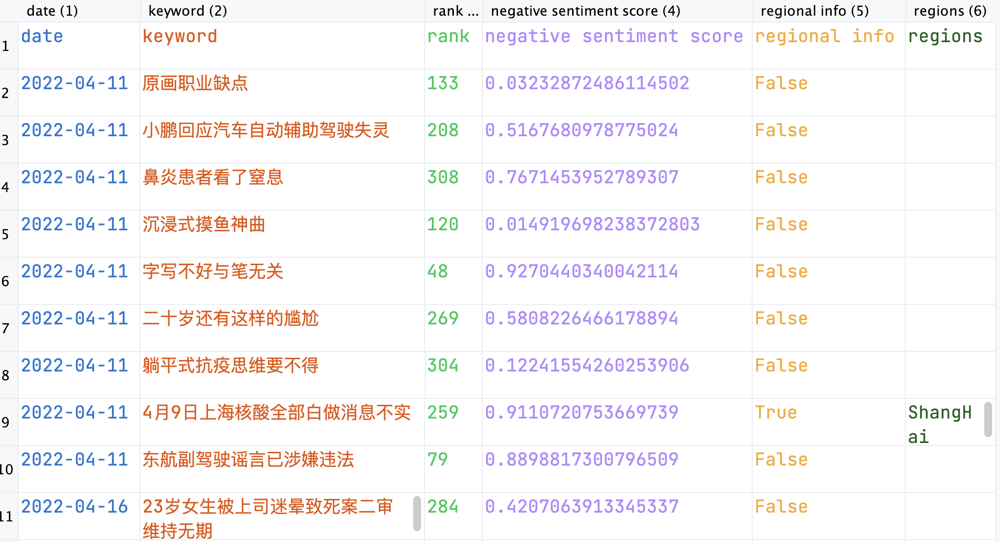

# Project

The code needed for the econometric analysis is an Rscript named ``did_apr_may.R''. 

The steps below introduces the procedure to collect data from scraping Weibo and to process data into an analyzable data set.

## Step 1: Configuration
### Install the required packages
```angular2html
pip install -r requirements.txt
```
### Clone all the keywords
```angular2html
git clone https://github.com/justjavac/weibo-trending-hot-search/tree/master/archives
```
### data sample:


## Step 2: Process the data
### Run the process_keywords.py to process the data, it will process all the keywords between start_date and end_date into the folder 'KWS'


## Step 3: Run the scraper
### configure the configure.
### d is the days to scrape, it would take 2 threads to run it and will scrape the 10 most negative topics within that day. Here the start date is '2022-05-09', and you can change it. For example {0..2} means it will scrape the data from '2022-05-09' to '2022-05-11'.
### i is the number of topics to scrape, multiplied by 2, here it will scrape 10 topics.
```angular2html
for d in {0..0}
do
    for i in {0..4}
    do
        mpirun -n 2 python3 run_spider.py 2022-05-09 $d $i &
        pid=$!
        wait $pid
    done
done
```

### Run the 'run.sbatch', you could change its configuration and run it multiple times to utilize the cluster.

### The result will be stored in the folder 'output'


## Step 4: clean and process the data
### Run the 'clean.sbatch' to clean the data, it will extract the important information and calculate the negative sentiment score, then save to the same folder. You could change its configuration and run it multiple times to utilize the cluster.
### Here the 3 means the days to clean from the start data '2022-05-08', and it could run with 3 threads.
```angular2html
mpirun -n 3 python3 clean.py 2022-05-08
```


## Step 5: Summarize the data
### Run the 'merge.py' to merge the cleaned data into one csv file and transform the location name from Chinese to English.


### Run the 'summary.py' to summarize the data, it will summary the topics collected into 'summary.csv'.


# Trouble shooting
### Please do not run too many sbatches at the same time, as it may cause the limited cluster to crash.
### If you reduce the 'DOWNLOAD_DELAY' in the 'settings.py', it may cause the spider to be blocked by the website.
### Sometimes it may only scrape one topic instead of 2 initially due to unknown reason, you can just stop and run it again.
### Sometimes it would always be blocked by the website, you can change the 'cookies.txt' and the 'user_agents.txt' to solve it.
